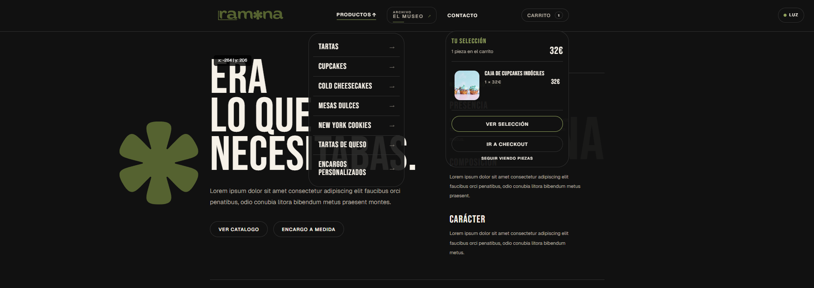

<h1 align="center">Hey, I'm Pablo 👋</h1>

  &nbsp;&nbsp;

<h3 align="center">Backend Developer building APIs and web products</h3>

  <strong>Java/Spring Boot</strong> for backend logic. <strong>Next.js/TypeScript</strong> for product interfaces. 
  SQL, testing, security and clean project structure.

<h4 align="center">📍 Based in Spain · 💻 Also into IT, PCs and performance.</h4>

---

## · Stack

### ⚙️ Backend core

  
  
  
  

  
  

### 🗄️ Persistence & testing

  
  
  
  

  
  
  

### 🎨 Web / product side

  
  
  
  
    
  

  
  

### 🧰 Tools & practices

  
  
  
    

  
  

  
    Layered Architecture · DTOs · Validation · Global Exception Handling · SOLID · Clean Code · Product-minded development
  

---

## · What I build

I learn backend by building projects with real product flows: APIs with authentication, database persistence, documentation, tests and user-facing features around them.

* REST APIs with authentication, authorization, validation, error handling and OpenAPI documentation.
* Backend applications structured with controllers, services, repositories, DTOs and mappers.
* SQL-based persistence with JPA/Hibernate, MySQL and PostgreSQL.
* Tests with JUnit 5, Mockito and Spring Boot Test.
* Full-stack flows: catalog, product pages, cart, checkout, orders and payment integration.
* Interfaces with attention to detail when the product needs more than just backend logic.

---

## · Main projects

<table>
  <tr>
    <td width="50%">
      
      <h3>- Supermarket Sales API</h3>
      

        My strongest backend project: a Spring Boot REST API for sales management with authentication, protected operations, business statistics, OpenAPI documentation and tests.
      

      

        <strong>Java 21 · Spring Boot · Spring Security · JWT · JPA/Hibernate · MySQL · Swagger · JUnit 5 · Mockito</strong>
      

    </td>
    <td width="50%">
      
      <h3>- E-commerce Platform</h3>
      

        Full-stack e-commerce project in progress: product catalog, dynamic pages, mini-cart, cart flow, checkout and backend/payment integration path.
      

      

        <strong>Next.js · React · TypeScript · Tailwind CSS · shadcn/ui · Framer Motion · Java · Spring Boot · PostgreSQL · SumUp API · Vercel</strong>
      

    </td>
  </tr>
</table>

---

## GitHub Activity

## · Current focus

  Clean APIs · Better tests · SQL persistence · Backend architecture · Product-like full-stack projects

---

  <strong>Looking for junior backend opportunities where I can keep building, learning and shipping real features.</strong>

